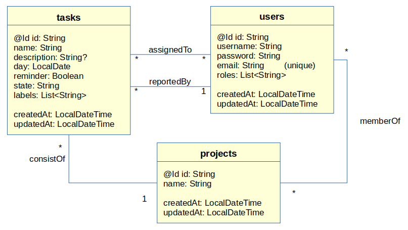

# Task Tracker REST API
This project implements a REST API server that manages tasks for a task's tracker system.
The tasks are stored in an H2 in-memory database. 

## Usage
Build the application with gradle:

    ./gradlew clean build

Run the application:

    ./gradlew bootrun

The REST API server runs at the port 5000.

## Definitions

### Data definition
#### Data model
The data model consists of three main entities: tasks, users and projects. 
Each project consists of zero or more tasks. Each task can be assigned only to 
one project. 

The user that creates a task is its reporter. A task can only 
be reported by exact one user. The user that reports the task can assign
other user to the task. One task can be assigned to zero or more 
users. A user can be member of zero or more projects.  
 

### REST API
#### Endpoints for user management
| Method | URL        | Action                                            |
|--------|------------|---------------------------------------------------|
| POST   | /login     | sign in with email and password                   |
| POST   | /register  | register new user with name, email and password   |
| GET    | /api/users | get the list of registered users (only for admin) |

After /register the user must sign in via the /login request. 
The response of the /login request contains the user details and two tokens: an access token for 
authorization the access to the resources, and a refresh token to renew the access token if it is expired. 
The token must be sent in the authorization header as Bearer Token.

#### Endpoints for tasks management
In order to use the tasks endpoints, the user must be authenticated before.

| Method | URL             | Action                       |
|--------|-----------------|------------------------------|
| GET    | /api/tasks      | get all tasks from database  |
| GET    | /api/tasks/{id} | get task details based on id |
| POST   | /api/tasks      | create a new task            |
| DELETE | /api/tasks/{id} | remove/delete task by id     |
| PUT    | /api/tasks/{id} | update task details by id    |

##### GET /api/tasks

##### GET /api/tasks/{id}

##### POST /api/tasks
Add a new task to the database and assign it to the project of the given project id.
the task is reported by the logged-in user.

###### Request
Content type: application/json

|               | Type         | Description             |
|---------------|--------------|-------------------------|
| Authorization | Bearer Token | access token from login |                      
| Body          | JSON data    | task data               |

Example value of request body:

    {
      "text": "New Task",
      "day": "2022-03-01",
      "reminder": true,
      "projectName": "p1"
    }

###### Response
Content type: application/json

| Code | Status       | Content / Message                                       |
|------|--------------|---------------------------------------------------------|
| 201  | Ok           | See example for response body below                     |
| 400  | Bad Request  | JSON parse error ...                                    |
| 401  | Unauthorized | Full authentication is required to access this resource |
| 401  | Unauthorized | The Token has expired on ...                            |
| 404  | Not found    | Project not found: ...                                  |

Example value of response body in case of code 201:

    {
        "id": "6274b0f846439e7351056517",
        "text": "New Task", "description": null, "day": "2022-03-01", "reminder": true,
        "state": "Created", "labels": [], "assignees": [],
        reportedBy": {
            "id": "6274b02b46439e7351056510", "name": "John Doe", "password": "...",
            "email": "john.doe@test.com", "roles": ["ROLE_USER"],
            "createdAt": "2022-05-06T09:20:43.174","updatedAt": null
        },
        "consistOf": {
            "id": "6274b02a46439e735105650f", "name": "p1",
            "createdAt": "2022-05-06T09:20:39.844","updatedAt": null
        },
        "createdAt": "2022-05-06T09:24:08.66346", "updatedAt": null
     }

